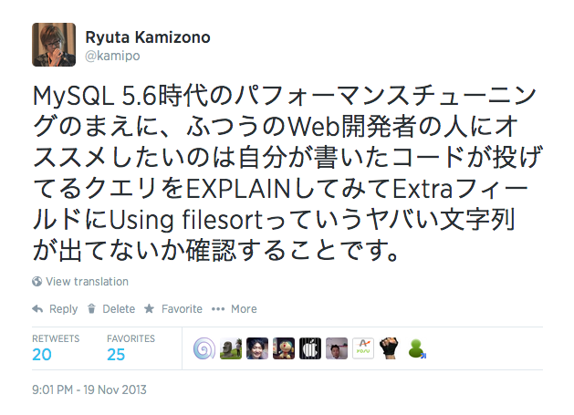
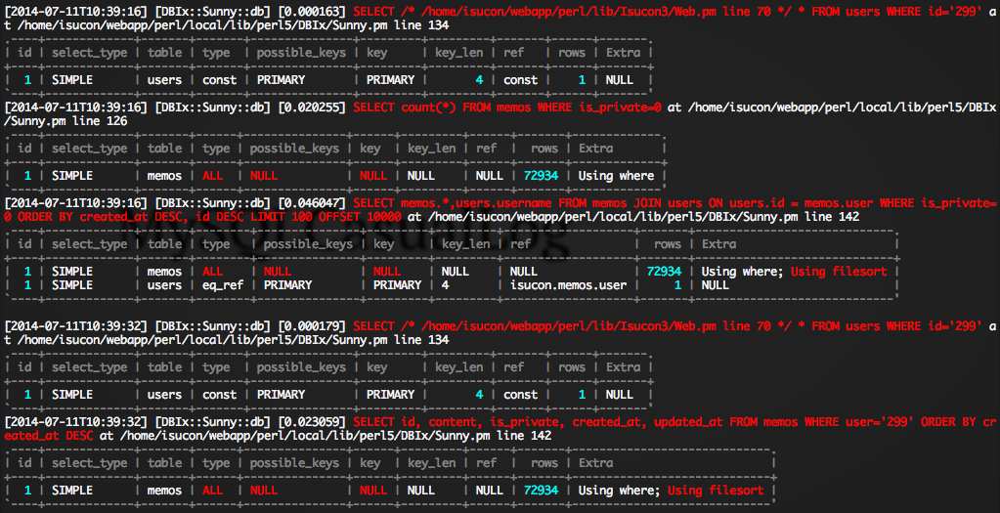
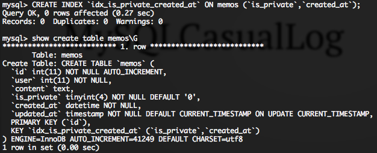

ふつうのWeb開発者のための クエリチューニング
==========

2014/07/11 
MySQL Casual Talks Vol.6 
<address>
[@kamipo](http://twitter.com/kamipo) 
[github/kamipo](https://github.com/kamipo)
</address>

&nbsp;
----------

[https://twitter.com/kamipo/status/402768579126259713](https://twitter.com/kamipo/status/402768579126259713)

DBIx::QueryLog
----------

DBIx::QueryLog
----------

[DBI で実際に発行されるクエリーを取得する DBIx::QueryLog を書いた](http://blog.livedoor.jp/xaicron/archives/51185796.html)
 
[DBIx::QueryLog で DBI で実行された SQL を丸見えにする！](http://perl-users.jp/articles/advent-calendar/2011/dbix/9)
 
[DBIx::QueryLog でクエリの実行計画も丸見えにする！](http://perl-users.jp/articles/advent-calendar/2011/dbix/20)

(☝ ՞ਊ ՞)☝
----------

* useするだけで全部のクエリをSTDERRにはいてくれる
* アプリケーションを一切変更することなく使えて便利
* `plackup -MDBIx::QueryLog app.psgi`

(☝◞‸◟)☝
----------

* これで問題を読み取れるのは訓練されたWeb開発者だけ
* クエリや実行計画から問題を読み取るには経験が必要
* 明らかにやばそうなクエリは機械的に判断できそう
 * [EXPLAIN Output Format](http://dev.mysql.com/doc/refman/5.6/en/explain-output.html)

&nbsp;
----------

[https://twitter.com/kamipo/status/402768579126259713](https://twitter.com/kamipo/status/402768579126259713)

明らかにやばそうなクエリ
----------

* select_type
 * DEPENDENT UNION
 * DEPENDENT SUBQUERY
 * UNCACHEABLE UNION
 * UNCACHEABLE SUBQUERY

明らかにやばそうなクエリ
----------

* type
 * index
 * ALL

明らかにやばそうなクエリ
----------

* possible_keys
 * NULL
* key
 * NULL

明らかにやばそうなクエリ
----------

* Extra
 * Using filesort
 * Using temporary

MySQLCasualLog
----------

[https://gist.github.com/kamipo/839e8a5b6d12bddba539](https://gist.github.com/kamipo/839e8a5b6d12bddba539)

MySQLCasualLog
----------

* useするだけで使える
* 実行計画のやばそうなところを色付けてくれる
* `plackup -MMySQLCasualLog app.psgi`

&nbsp;
----------

&nbsp;
----------

&nbsp;
----------

明らかにやばそうなクエリ？
----------

* rows
 * 小さいときは問題ない
 * 大きいときに問題ないか判断するには経験が必要

参考
----------

[ORDER BY 狙いのキーの話](http://togetter.com/li/564015)
 
[ORDER BY 狙いのキーの話2](http://togetter.com/li/579823)
 
[2014年なんだからCOUNT(*)とかSQL_CALC_FOUND_ROWSとかLIMIT OFFSETのページングはやめようぜ](http://togetter.com/li/640847)
 
[ORDER BY狙いのキーが何故速いか](http://techblog.karupas.org/entry/2014/03/24/200850)
 
[WHERE狙いのキー、ORDER BY狙いのキー](http://yapcasia.org/2014/talk/show/e495bc1a-f30d-11e3-b7e8-e4a96aeab6a4)

Thanks!
----------

