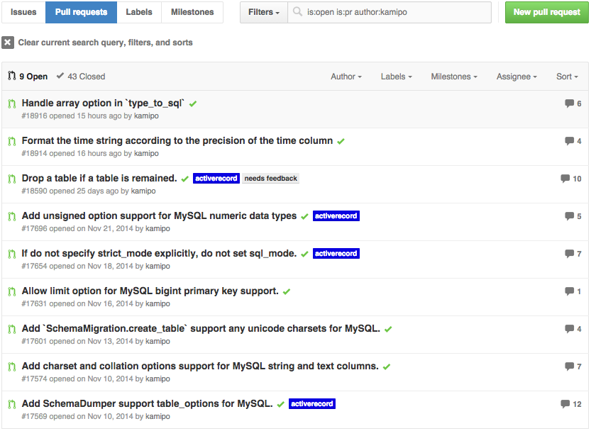
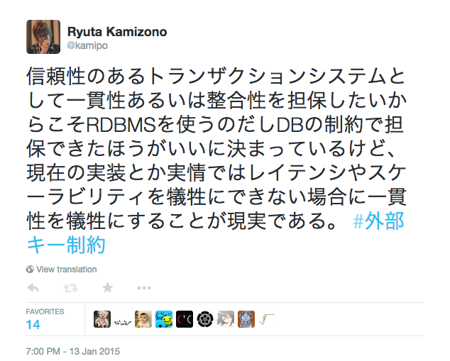

我々は何故RDBMSを使うのか
==========

2015/02/13 
外部キー Night 
<address>
[@kamipo](https://twitter.com/kamipo) 
[github/kamipo](https://github.com/kamipo)
</address>

About me
----------

* [twitter/kamipo](https://twitter.com/kamipo)
* [github/kamipo](https://github.com/kamipo)
* [qiita/kamipo](http://qiita.com/kamipo)
* [かみぽわーる](http://blog.kamipo.net/)

Recent state
----------

* [MySQLとActiveRecord](http://kamipo.github.io/talks/20141110-mdb_casual/#/title)
* [MySQLとActiveRecord その後](http://kamipo.github.io/talks/20141212-mysqlcasual7/#/title)

Recent state
----------

Recent state
----------

我々は何故RDBMSを使うのか
----------

* 信頼性のあるトランザクションシステムとして一貫性あるいは整合性を担保したい

信頼性のあるトランザクションシステムの持つべき性質
----------

* ACID
    * Atomicity(原子性)
    * Consistency(一貫性)
    * Isolation(独立性)
    * Durability(永続性)

信頼性のある(以下略)を担保するためのRDBMSの機能
----------

* トランザクション
    * トランザクション分離レベル
* 制約(Constraint)
    * NOT NULL 制約
    * UNIQUE 制約
    * PRIMARY KEY 制約
    * FOREIGN KEY 制約
    * CHECK 制約

トランザクションについての事例
----------

* [@yamionp](https://twitter.com/yamionp)さんの資料が興味深い
* [分割と整合性と戦う](http://www.slideshare.net/yugoshimizu/ss-38626214)
    * 機能単位で垂直分割したシステムで多発する不整合
    * XAトランザクションによる一貫性担保
    * そして伝説へ...

制約(Constraint)
----------

* データの不整合を防いで一貫性を担保する機能
    * NOT NULL 制約
    * UNIQUE 制約
    * PRIMARY KEY 制約
    * FOREIGN KEY 制約
    * CHECK 制約

よく使う制約
----------

* 制約の検査における影響範囲が限定的
    * NOT NULL 制約
    * UNIQUE 制約
    * PRIMARY KEY 制約

あまり使われない制約
----------

* FOREIGN KEY 制約
    * 今日のお題
* CHECK 制約
    * MySQLでは使えない(☝◞‸◟)☝

FOREIGN KEY 制約
----------

* 参照整合性(referential integrity)を担保するための機能
* 参照関係(親子関係)のあるデータの一貫性を担保する
    * has\_many / has\_one / belongs\_to

ON [ DELETE | UPDATE ]
----------

* 親が更新(削除)されるときの挙動
    * RESTRICT
    * CASCADE
    * SET NULL
    * NO ACTION

MySQLとFOREIGN KEY
----------

* その昔MySQLのデフォルトのストレージエンジンはMyISAMだった
    * トランザクション非対応
    * FOREIGN KEY使えない
    * クラッシュセーフではない
    * ACIDとはRDBMSとは何だったのか...
* 良くも悪くもMyISAMは20世紀のMongoDBだった

外部キー制約張るとデータ入れるのがめんどい(FAQ)
----------

* たしかにMySQLはめんどい部分はある
* MySQLは即時制約チェックしか対応してない
    * ステートメント毎に制約チェック
    * MySQLではRESTRICTとNO ACTIONは同じ動作になる
* 他のRDBMSは遅延制約チェックにすることができる
    * トランザクションコミット時に制約チェック

制約は(一時的に)無効にできる
----------

<pre style="font-size: 80%"><code># mysqldump
SET @OLD_UNIQUE_CHECKS=@@UNIQUE_CHECKS,
    UNIQUE_CHECKS=0;
SET @OLD_FOREIGN_KEY_CHECKS=@@FOREIGN_KEY_CHECKS,
    FOREIGN_KEY_CHECKS=0;
SET @OLD_SQL_MODE=@@SQL_MODE,
    SQL_MODE='NO_AUTO_VALUE_ON_ZERO';
</code></pre>

制約は(一時的に)無効にできる
----------

* `mysqldump`の出力するSQLでも使われている
    * [UNIQUE_CHECKS](http://dev.mysql.com/doc/refman/5.6/en/server-system-variables.html#sysvar_unique_checks)
    * [FOREIGN_KEY_CHECKS](http://dev.mysql.com/doc/refman/5.6/en/server-system-variables.html#sysvar_foreign_key_checks)
* データのリストアやfixtureのロード等データの整合性をチェックしなくても一貫性が保証できる場合に制約を無効にするのは有り

システム構成や要件によって制約を使えない場合がある
----------

システム構成や要件によって制約を使えない場合がある
----------

システム構成や要件によって制約を使えない場合がある
----------

* 現在のRDBMSの実装上の制限による問題
    * [我々(主語が大きい)は何故MySQLで外部キーを使わないのか](http://songmu.github.io/slides/fk-night/#0)
* システム構成や要件による制限
    * DB分割等

将来的には技術的に解決されてほしい
----------

@kamipo said:

    現状の cascading delete がWeb屋さんの実用上問題なのは一気に大量の行が消えるってなったときに他のトランザクションが長時間待たされるからだから、この外部キーの参照先が消えたってのをキューイングしといて参照整合性だけ保って裏でゆっくり消える機能があればいいと思う。

将来的には技術的に解決されてほしい
----------

@kamipo said:

    ポスグレにはインデックス作成で書き込みをブロックしないCONCURRENTLYオプションとかもあるのだから、大量の行に触るオペレーションには実用上問題があるケースがあることはわかってるってことだし参照整合性を保ってゆっくり消すのをユーザーが実装するのは無駄な労力だと思われる。

将来的には技術的に解決されてほしい
----------

@kamipo said:

    SELECT COUNT(*) 貯金とか ORDER BY RAND 貯金とか ON DELETE CASCADE 貯金とかして毎月会社で飲み会したい

制約を使える場合でも万能ではない
----------

* 要件に合わない使い方をすれば当然問題になる
    * 特にON DELETE CASCADEが問題になる場合が多い

ON DELETE CASCADEがヤバいシステムをどうするか
----------

* 親データの削除で大量の子データも同時に削除される
    * 大量の行が削除される巨大トランザクションで他のトランザクションが待たされる
    * MySQLのレプリケーションのようにslaveがシングルスレッドで更新していると巨大トランザクションでslaveが遅延していく
* 設計をなおすまでは運用でカバーするしかない

ON DELETE CASCADEがヤバいシステムをどうするか
----------

* 仕様を変更できるなら
    * ユーザーさんは自分の投稿したデータを自分で削除してから退会できます
    * 殿堂入りユーザーさんは退会できません
    * ユーザーは論理削除して投稿データは削除済みで表示する
        * ニコ動みたいな感じ？

レビュー重要
----------

* 要件に合わない使い方をすればどんな機能でも問題になりうる
* 設計の正解は難しい
    * 将来の要件まで見通すのは経験によるところもある

レビュー重要
----------

我々は何故RDBMSを使うのか
----------

* 信頼性のあるトランザクションシステムとして一貫性あるいは整合性を担保したい
* システム構成や要件によって制約を使えない場合がある
 * その場合アプリケーション側で一貫性を担保する必要がある
* (制約を使うにしろ使わないにしろ)要件に合わないと問題になりうる
* (設計ミスを機械的に防げればいいが現状は)レビュー重要

以上
----------

