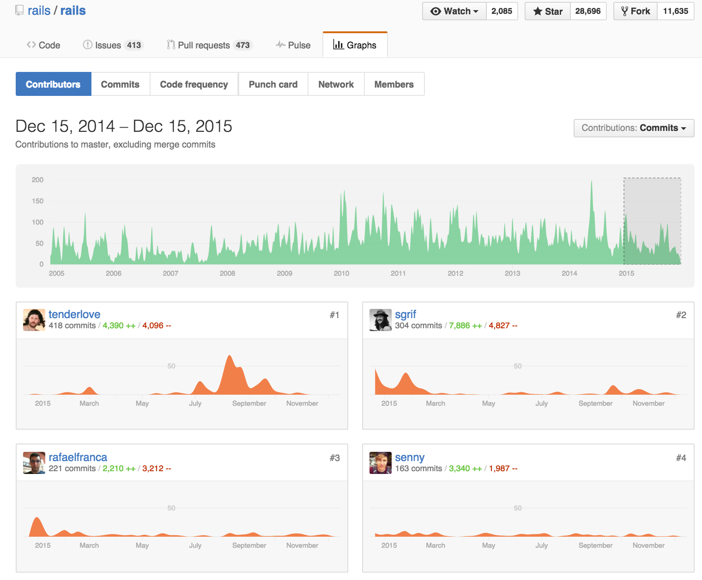
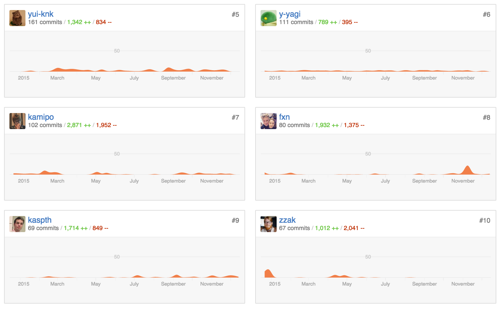

ActiveRecordとMySQL 5.7
==========

2015/12/15 
MySQL User Conference Tokyo 2015 
<address>
[@kamipo](https://twitter.com/kamipo) 
Treasure Data, Inc.
</address>

About me
----------

* [twitter/kamipo](https://twitter.com/kamipo)
* [github/kamipo](https://github.com/kamipo)
* [qiita/kamipo](http://qiita.com/kamipo)
* [かみぽわーる](http://blog.kamipo.net/)

近況🐬
----------

2年前のRails
----------

* [RailsのMySQL対応が弱いやつ](http://togetter.com/li/599389)
 * RailsのSchema Migration機能ではMySQL対応が弱かった
		* https://github.com/rails/rails/pull/12962
 * ブログ等で問題を訴えてる人はいたがMySQLのクソクエリが放置されていた
		* https://github.com/rails/rails/pull/13040

1年前のRails
----------

* [Rebuild: 56](http://rebuild.fm/56/)
* a_matsudaさんがゲストの回でActiveRecordのMySQL対応について言及されてる

1年前のRails
----------

    miyagawa「MySQLのdatetimeでmicrosecondサポートするやつマージされるのに1年半ぐらいかかった」

* [MySQL 5.6 and later supports microsecond precision in datetime. #8240](https://github.com/rails/rails/pull/8240)

1年前のRails
----------

    a_matsuda「ARメンテしてる人が全員ポスグレ派でMySQL使ってる人がたぶん誰もいない」

1年前のRails
----------

    a_matsuda「MySQLまわりのパッチはめっちゃ放置される傾向にあります」

MySQLとActiveRecord
----------

* Rails複数DB Casual TalksでMySQLとActiveRecordの話をしてきた
 * http://blog.kamipo.net/entry/2014/11/16/112225

Rails Contributors in this year
----------

Rails Contributors in this year
----------

Edge Rails
----------

* この一年でかなり状況は改善された
* もはやRailsはMySQL対応が弱いフレームワークではなくなった

改善された問題
----------

utf8_unicode_ci
----------

* [ActiveRecordでデフォルトの照合順序を変更する](http://qiita.com/kamipo/items/d7863f0df24916005657)
* [utf8_unicode_ci に対する日本の開発者の見解](http://blog.kamipo.net/entry/2015/03/08/145045)
 * [MySQL と Unicode Collation Algorithm (UCA)](http://blog.kamipo.net/entry/2015/03/17/103457)
 * [MySQL と寿司ビール問題](http://blog.kamipo.net/entry/2015/03/23/093052)

utf8_unicode_ci
----------

* [The default collation should not be change #20000](https://github.com/rails/rails/pull/20000)
* [Remove `DEFAULT_CHARSET` and `DEFAULT_COLLATION`](https://github.com/rails/rails/pull/22061)

strict_mode
----------

* [ActiveRecordでstrict_modeを無効にする](http://qiita.com/kamipo/items/2ce1d668afbb3d2afd86)
* [Don't want to overwrite sql_mode, but how is gone. #17370](https://github.com/rails/rails/issues/17370)
* [If specify `strict: :default` explicitly, do not set sql_mode. #17654](https://github.com/rails/rails/pull/17654)

Datetime rounding problem
----------

* [MySQL 5.6からDATETIMEは小数点以下が四捨五入(round)されるので気を付けよう](http://qiita.com/kamipo/items/fb3f7aff8e08fcd67898)
* [Format the datetime string according to the precision of the datetime field. #18067](https://github.com/rails/rails/pull/18067)

MySQL 5.7への対応
----------

MySQL 5.7への新機能対応
----------

* [Add a native JSON data type support in MySQL #21110](https://github.com/rails/rails/pull/21110)
* [Add Generated Columns support for MySQL 5.7 #22589](https://github.com/rails/rails/pull/22589)

MySQL 5.7への非互換対応
----------

* show_compatibility_56=off
* derived_merge=on
* ONLY_FULL_GROUP_BY

show_compatibility_56=off
----------

* [MySQL 5.7では迂闊にperformance_schemaをOFFするとSHOW STATUSが使えない](http://yoku0825.blogspot.jp/2015/07/mysql-578performanceschemaoffshow-status.html)
* [Support MySQL 5.7.8 which enables show_compatibility_56=off #21318](https://github.com/rails/rails/pull/21318)

derived_merge=on
----------

* [MySQL 5.7のoptimizer_switch、derived_mergeとは何ぞや](http://blog.kamipo.net/entry/2015/12/08/075800)
* [Materialize subqueries by adding `DISTINCT` to suport MySQL 5.7.6 and later #19359](https://github.com/rails/rails/pull/19359)

ONLY_FULL_GROUP_BY
----------

* [MySQL 5.7のONLY_FULL_GROUP_BYはちょっと進化してた](http://blog.kamipo.net/entry/2015/12/14/171838)
* [Add `columns_for_distinct` for MySQL 5.7 with ONLY_FULL_GROUP_BY #22241](https://github.com/rails/rails/pull/22241)

まとめ
----------

* RailsのMySQL対応はこの一年でかなり状況は改善された
* もはやRailsはMySQL対応が弱いフレームワークではなくなった

That's all
----------

