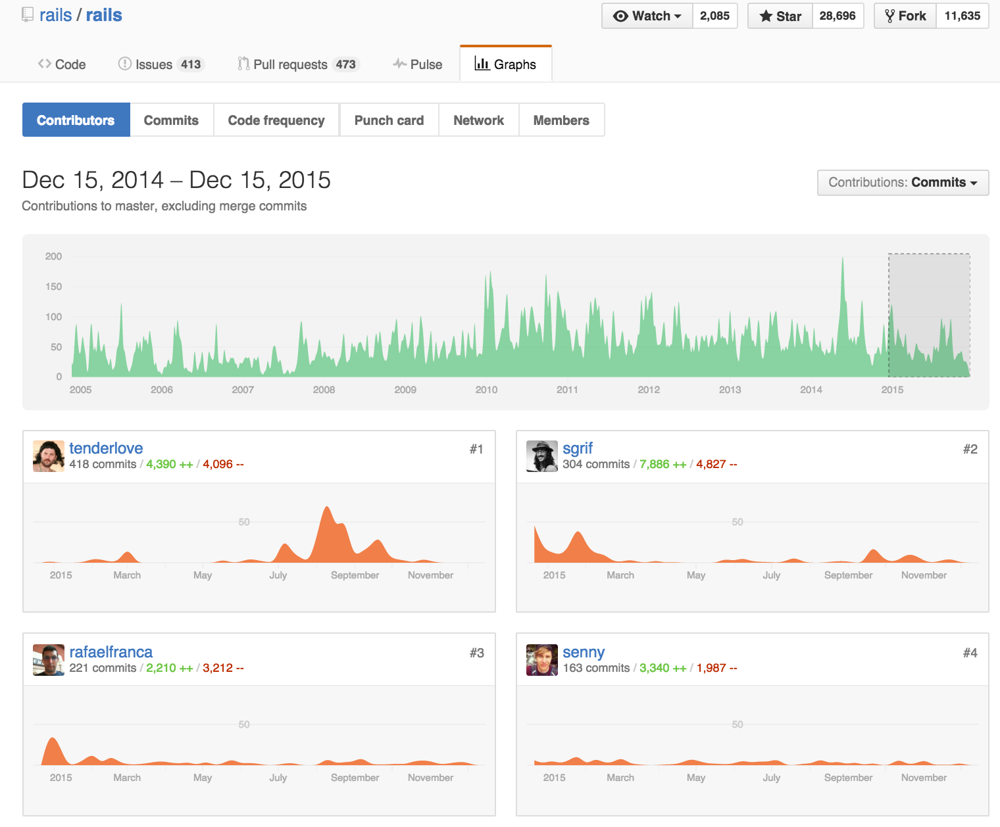
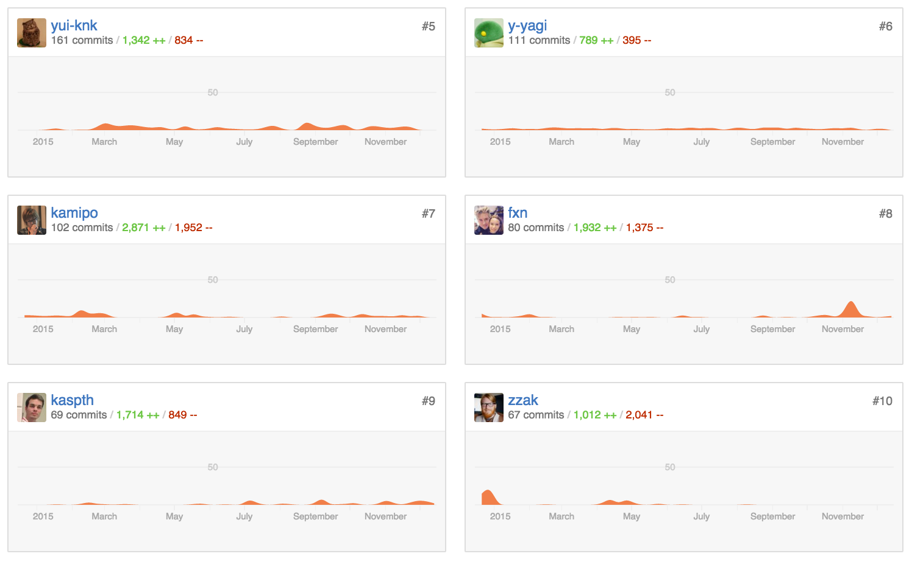

MySQLとUnicode
==========

2016/01/22 
MySQL Casual Talks vol.9 
<address>
[@kamipo](https://twitter.com/kamipo) 
[github/kamipo](https://github.com/kamipo)
</address>

About me
----------

* [twitter/kamipo](https://twitter.com/kamipo)
* [github/kamipo](https://github.com/kamipo)
* [qiita/kamipo](http://qiita.com/kamipo)
* [かみぽわーる](http://blog.kamipo.net/)

About me
----------

Rails Contributors in 2015
----------

Rails Contributors in 2015
----------

Planning the defaults for MySQL 5.8
----------

* Character Set and Collation
 * http://mysqlserverteam.com/planning-the-defaults-for-mysql-5-8/

Planning the defaults for MySQL 5.8
----------

    We are considering changing the default character set to utf8mb4. Modern applications frequently store 4 byte characters, as emoji input is common for mobile devices.

Planning the defaults for MySQL 5.8
----------

    In addition to utf8mb4, we are also considering switching the default collation to be utf8mb4_unicode_520_ci.

MySQLとUnicodeとkamipo
----------

* [utf8_unicode_ci に対する日本の開発者の見解](http://blog.kamipo.net/entry/2015/03/08/145045)
* [MySQL と Unicode Collation Algorithm (UCA)](http://blog.kamipo.net/entry/2015/03/17/103457)
* [MySQL と寿司ビール問題](http://blog.kamipo.net/entry/2015/03/23/093052)
* [#76553: Sushi-Beer issue of MySQL with utf8mb4](https://bugs.mysql.com/bug.php?id=76553)

ハハパパ🍣🍺問題
----------

* utf8mb4_general_ci
 * ハハパパ🙆　🍣🍺🙅
* utf8mb4_unicode_ci
 * ハハパパ🙅　🍣🍺🙅
* utf8mb4_unicode_520_ci
 * ハハパパ🙅　🍣🍺🙆
* utf8mb4_bin
 * ハハパパ🙆　🍣🍺🙆

🍣🍺問題
----------

* MySQLで文字列の比較に使われるcollating weightの仕様がおかしい
 * collating weightがある文字はそれを使う。ない場合は以下に従う。
 * BMP文字でgeneral collation (xxx_general_ci)の場合、コードポイントを使う。
 * BMP文字でunicode collation (xxx_unicode_ci)の場合、なんかいい感じの計算式で導出する。
 * SMP文字(絵文字とか)の場合、0xfffd REPLACEMENT CHARACTERと同じweightになる😳

ハハパパ問題
----------

* MySQLがUnicode Collation Algorithm (UCA)の一部しか実装していない
* UCAではMulti-Level Comparisonといって複数レベルに分けて文字列の比較を行い、各レベルの比較で文字列が一致した場合(tie-breaking level)、次のレベルで比較を行うを繰り返して順序を決定する。
 * L1は大文字小文字アクセント無視(Base Charaters)
 * L2はアクセントを無視しない(Accents)
 * L3は大文字小文字を無視しない(Case/Variants), etc...

ハハパパ問題
----------

* Primary weight range(L1比較のためのweight)しか実装していない
 * Base Charatersの区別はされるがアクセント(濁点半濁点)の区別はされない
 * 日本語の文字列比較には適さない
* We can't wait utf8mb4_japanese_ci...😫

ハハパパ問題
----------

[mysql-5.7.10/strings/ctype-uca.c#L17-L31](https://github.com/mysql/mysql-server/blob/mysql-5.7.10/strings/ctype-uca.c#L17-L31)

<pre style="font-size: 60%"><code>
/* 
   UCA (Unicode Collation Algorithm) support. 
   Written by Alexander Barkov <bar@mysql.com>
   
   Currently supports only subset of the full UCA:
   - Only Primary level key comparison
   - Basic Latin letters contraction is implemented
   - Variable weighting is done for Non-ignorable option
   
   Features that are not implemented yet:
   - No Normalization From D is done
     + No decomposition is done
     + No Thai/Lao orderding is done
   - No combining marks processing is done
*/
</code></pre>

まとめ
----------

* utf8mb4_general_ci
 * ハハパパ🙆　🍣🍺🙅
* utf8mb4_unicode_ci
 * ハハパパ🙅　🍣🍺🙅
* utf8mb4_unicode_520_ci
 * ハハパパ🙅　🍣🍺🙆
* utf8mb4_bin
 * ハハパパ🙆　🍣🍺🙆

That's all🍻
----------

