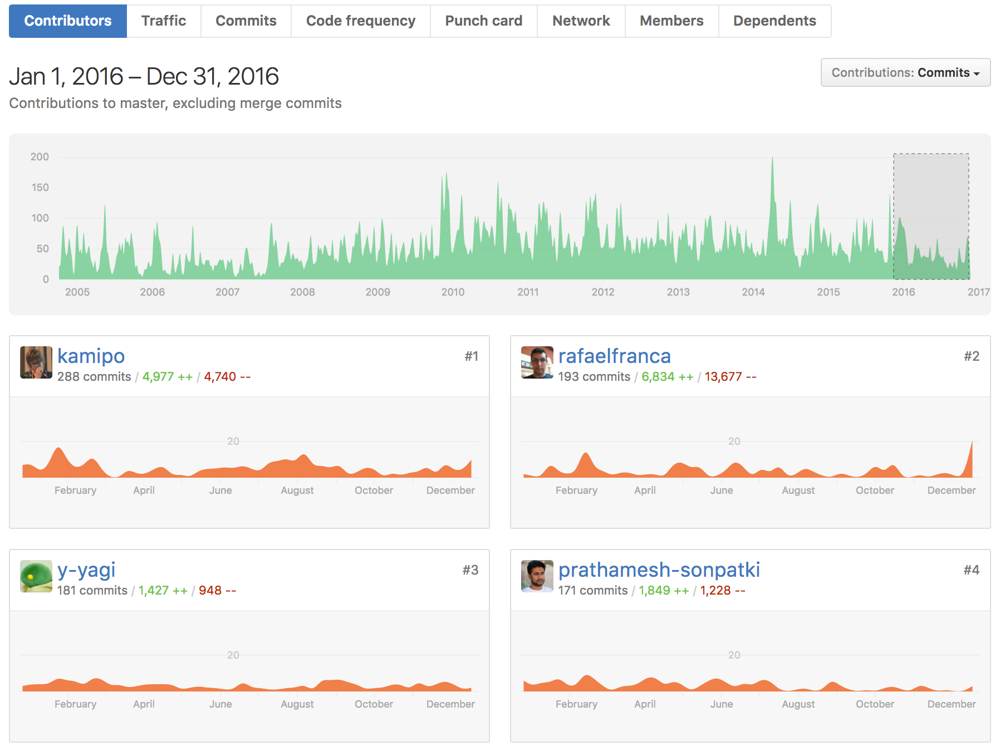

知って得しない Active Record Issues (MySQL編)
==========

2017/02/01 
MySQL Casual Talks vol.10 
<address>
[@kamipo](https://twitter.com/kamipo) 
[github/kamipo](https://github.com/kamipo)
</address>

About me
----------

* [第1部：君がッ！ 泣いてマージするまで、プルリクを送ることをやめないッ！](http://press.forkwell.com/post/156285265531/interview-kamipo-1)
* [第2部：「この境地にいるのは自分だけ」ー 自身を追い込み続けてたどり着いた「高み」](http://press.forkwell.com/post/156601527154/interview-kamipo-2)
* [第3部：金髪の神エンジニア・kamipo 伝説のもうひとつの真実](http://press.forkwell.com/tagged/%E3%83%AA%E3%83%AC%E3%83%BC%E3%82%A4%E3%83%B3%E3%82%BF%E3%83%93%E3%83%A5%E3%83%BC)

Rails Contributors in 2016
----------

知って得しない Active Record Issues
----------

世の中には通常では考えられない使い方をする人々がいる

[#27125 zerofillを使うとunsignedの判定に失敗する](https://github.com/rails/rails/issues/27125)
----------

* `enum('foo','bar','unsigned')` みたいなのがunsignedと判定されないように直したらzerofill属性ついてるときにunsigned判定されなくなってしまった [#22896](https://github.com/rails/rails/pull/22896)
* なんでzerofillついてるテーブルをActive Recordで扱いたいのか理解に苦しむけどzerofill考慮するように修正 [#27126](https://github.com/rails/rails/pull/27126)

[#25300 ANSI_QUOTESが有効だとON DELETE CASCADEとかが吹っ飛ぶ](https://github.com/rails/rails/issues/25300)
----------

* もともと `sql_mode` が `STRICT_ALL_TABLES` で上書きされていたのを追加(append)に変更したら世の中には `ANSI_QUOTES` を有効にして運用してる人がいた [#24167](https://github.com/rails/rails/pull/24167)
* `SHOW CREATE TABLE` から `ON DELETE CASCADE` なところを正規表現で抽出してたのが `ANSI_QUOTES` でクオートが `"` に変わって正規表現がマッチしなくなった
* `information_schema`(`referential_constraints`) から抽出するように修正 [#25307](https://github.com/rails/rails/pull/25307)

[#27579 外部キー取得が死ぬほど遅くなった](https://github.com/rails/rails/issues/27579)
----------

* さっきの修正([#25307](https://github.com/rails/rails/pull/25307))でもともと0.1秒ぐらいだったのが26秒ぐらい掛かるようになった
 * おまけに MySQL 5.1.10 から追加されたテーブルを使ってしまったので MySQL 5.0 で動かなくなった [#27422](https://github.com/rails/rails/issues/27422)
* `information_schema` にはインデックスがないけど特定の条件で絞り込むと最適化が効くらしい
 * https://dev.mysql.com/doc/refman/5.7/en/information-schema-optimization.html
* 最適化が効くように各テーブルに条件を追加 [#27580](https://github.com/rails/rails/pull/27580)

壊したっていいじゃない にんげんだもの
----------

かみぽ

That's all🍻
----------

