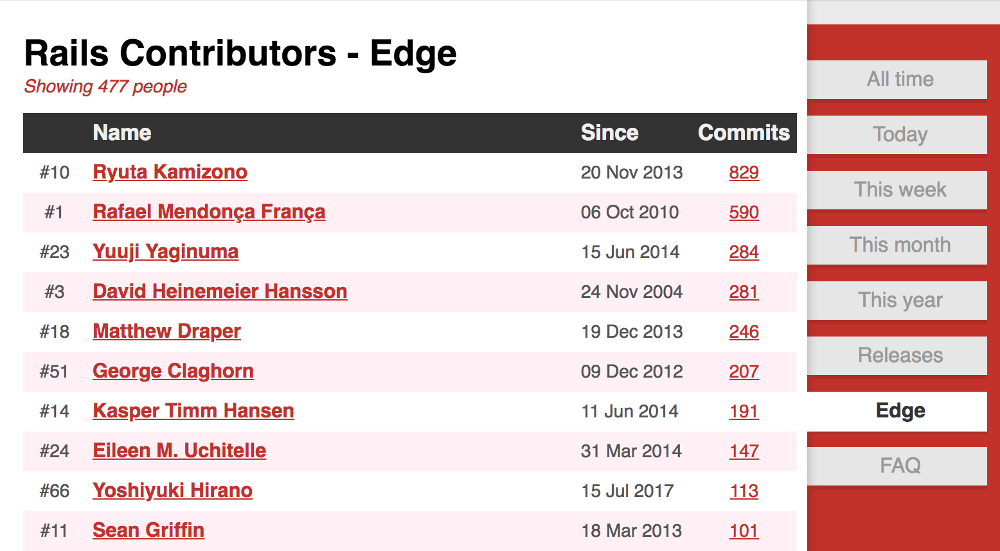

Rails 5.2のActive Recordの改善
==========

2018/02/15 
PLAZMA OSS Day: TD Tech Talk 2018 
<address>
Ryuta Kamizono ([@kamipo](https://github.com/kamipo)) 
Treasure Data, Inc.
</address>

About me
----------

* Ryuta Kamizono ([@kamipo](https://github.com/kamipo))
* Software Engineer at Treasure Data, Inc.
* Oracle ACE (MySQL expert) alumni
* Rails Commiters Team
* Ruby Prize 2017

Activity
----------

去年の8月にRailsコミッターになったのでIssues/PRをがんばって減らせるようになった

Activity
----------

https://twitter.com/kamipo/statuses/842643547652161536

Activity
----------

https://twitter.com/kamipo/statuses/894845890489229313

Activity
----------

https://twitter.com/kamipo/status/959364908721688576

Rails Contributors - Edge
----------

http://contributors.rubyonrails.org/edge/contributors

Rails 5.2.0 RC1 has released!
----------

[Rails 5.2.0 RC1: Active Storage, Redis Cache Store, HTTP/2 Early Hints, CSP, Credentials](http://weblog.rubyonrails.org/2018/1/30/Rails-5-2-RC1-Active-Storage-Redis-Cache-Store-HTTP2-Early-Hints-Credentials/)

Rails 5.2.0 RC1 has released!
----------

リリースノートに載るような新機能はないけど5.1以前では解決されていなかった多くの問題が5.2のActive Recordでは改善されている

今日取り上げる`eager_load`の問題
----------

* `count`が複雑すぎる問題
* `apply_join_dependency`忘れすぎ問題
* `association scope`内のJOINを無視する問題
* JOINを無視しないようにするとtable aliasが崩壊する問題

`eager_load`とは
----------

Active Recordで定義したassociationをJOINして親レコードをロードするときに同時に先読みする機能

<pre style="font-size: 70%"><code>
  class Post < ActiveRecord::Base
    has_many :comments
  end

  class Comment < ActiveRecord::Base
    belongs_to :post
  end

  Comment.eager_load(:post).each do |comment|
    puts "#{comment.body} : commented on #{comment.post.title}"
  end
</code></pre>

`count`が複雑すぎる問題
----------

性能特性を維持するために[#26972](https://github.com/rails/rails/pull/26972)でサブクエリ内(なぜ`count`でサブクエリが生成されるかは後述する)のORDER BYを維持するよう修正したら(そもそもORDER BYを取り除くと結果が異なってしまうケースもある), PostgreSQL + DISTINCT + ORDER BYの制約に引っかかる問題を生み出してしまった

`count`が複雑すぎる問題
----------

* [Fix `COUNT(DISTINCT ...)` with `ORDER BY` and `LIMIT` #29848](https://github.com/rails/rails/pull/29848)
* [Fix `COUNT(DISTINCT ...)` for `GROUP BY` with `ORDER BY` and `LIMIT`](https://github.com/rails/rails/commit/5668dc6b1863ef43be8f8ef0fb1d5db913085fb3)
* [Fix `count(:all)` to correctly work `distinct` with custom SELECT list](https://github.com/rails/rails/commit/c6cd9a59f200863ccfe8ad1d9c5a8876c39b9c5c)
* [Fix `count(:all)` with eager loading and having an order other than the driving table](https://github.com/rails/rails/commit/ebc09ed9ad9a04338138739226a1a92c7a2707ee)

`count`が複雑すぎる問題
----------

集合関数系メソッドの中で`count`だけLIMITの扱いが特殊(`count`する前にLIMITが適応された結果を返す仕様になっている)

<pre style="font-size: 70%"><code>
  posts = Post.order(:id).limit(3)

  posts.to_a
  # => SELECT posts.* FROM posts ORDER BY posts.id LIMIT 3

  posts.count
  # => SELECT COUNT(*) FROM (SELECT posts.* FROM posts ORDER BY posts.id LIMIT 3)

  posts.count(:published)
  # => SELECT COUNT(count_column) FROM (SELECT posts.published AS count_column FROM posts ORDER BY posts.id LIMIT 3)
</code></pre>

`count`が複雑すぎる問題
----------

`joins`/`left_joins`と`includes`/`eager_load`では同じ結果になるとは限らない(`eager_load`は主テーブルの件数を維持するために`COUNT(DISTINCT id)`なクエリを生成する)

<pre style="font-size: 70%"><code>
  post = Post.create!(title: "post1")
  Post.create!(title: "post2")
  Post.create!(title: "post3")

  post.comments.create!([{ body: "comment1" }, { body: "comment2" }]) 

  Post.joins(:comments).count # => 2
  Post.left_joins(:comments).count # => 4
  Post.eager_load(:comments).count # => 3
</code></pre>

`count`が複雑すぎる問題
----------

`joins`/`left_joins`と`includes`/`eager_load`では同じ結果になるとは限らない(`eager_load`は主テーブルの件数を維持するために`COUNT(DISTINCT id)`なクエリを生成する)

<pre style="font-size: 70%"><code>
  post = Post.create!(title: "post1")
  Post.create!(title: "post2")
  Post.create!(title: "post3")

  post.comments.create!([{ body: "comment1" }, { body: "comment2" }]) 

  Post.joins(:comments).map(&:id) # => [1, 1]
  Post.left_joins(:comments).map(&:id) # => [1, 1, 2, 3]
  Post.eager_load(:comments).map(&:id) # => [1, 2, 3]
</code></pre>

`count`で起きていた問題
----------

* 性能を無視すれば元クエリをそのままサブクエリ(`SELECT COUNT(*) FROM (SELECT ...)`)にすればほぼ期待した結果になる
 * つまりクエリをなんらかの理由で書き変えようとしているから動かなくなったり結果が正しくなくなったりする
* クエリの書き変えを仕様上回避できないのは`eager_load`のときに付けるDISTINCTだけなのでそのケースだけPostgreSQLにも配慮したクエリが生成されるようにした

`apply_join_dependency` 忘れすぎ問題
----------

`apply_join_dependency`は`eager_load`をJOINに変換してくれるやつ。`eager_load`をJOINにしないと正しいクエリにならないケースでは常にクエリ組み立て前に明示的に呼び出す必要がある。

`apply_join_dependency` 忘れすぎ問題
----------

5.1以前では`#to_a`, `#to_sql`, `#pluck`, `#exists?`, 集合関数系(`#count` etc)だけでしか明示的に呼ばれてないのでそれ以外のJOINにしないといけないケース(`#from`, `#where`, `#update_all`, `#delete_all`, `#cache_key`)では正しく動かなかった

`apply_join_dependency` 忘れすぎ問題
----------

5.2では`#exists?`や`#count`が動くケースではほぼ`#update_all`, `#delete_all`も動くようになった

<pre style="font-size: 70%"><code>
  posts = Post.joins(:comments).where("comments.hidden": true)

  if posts.exists?
    assert_equal posts.count, posts.delete_all
  end
</code></pre>

`association scope`内のJOINが無視される問題
----------

5.1以前では`eager_load`の`association scope`内のJOINはすべて捨てられてしまうので、
例えば特定のタグが付いたコメントだけを`eager_load`したいようなケースで問題になる。

`association scope`内のJOINが無視される問題
----------

<pre style="font-size: 70%"><code>
  class Post < ActiveRecord::Base
    has_many :tagged_comments,
      -> { left_joins(:tags).where("tags.name": "Tagged") },
      class_name: "Comment", inverse_of: :post
  end

  class Comment < ActiveRecord::Base
    belongs_to :post, inverse_of: :tagged_comments
    has_many :tags
    has_many :tagged_tags, -> { where(name: "Tagged") }, class_name: "Tag"
  end

  class Tag < ActiveRecord::Base
    belongs_to :comment
  end
</code></pre>

`association scope`内のJOINが無視される問題
----------

5.2ではJOINを捨てないように修正したので以下の例は動くようになった

<pre style="font-size: 70%"><code>
  class Post < ActiveRecord::Base
    has_many :tagged_comments,
      -> { left_joins(:tags).where("tags.name": "Tagged") },
      class_name: "Comment", inverse_of: :post
  end

  Post.eager_load(:tagged_comments).first
</code></pre>

JOINを無視しないようにするとtable aliasが崩壊する問題
----------

SQLでは同じテーブルを複数回JOINすると別の名前を付けないとどちらのテーブルのカラムを参照しているのか曖昧になってしまうので、
同じ名前がJOIN内に出現しないようにtable aliasを振っていく必要がある

JOINを無視しないようにするとtable aliasが崩壊する問題
----------

JOINをこれまで捨てていたのでActive Recordには`association scope`内のJOINにまでalias trackingが考慮されていない問題があった。
以下の例は`tags`テーブルが2回JOINされてエラーになる。

<pre style="font-size: 70%"><code>
  class Post < ActiveRecord::Base
    has_many :tagged_comments,
      -> { left_joins(:tags).where("tags.name": "Tagged") },
      class_name: "Comment", inverse_of: :post
  end

  Post.eager_load(tagged_comments: :tags).first
</code></pre>

JOINを無視しないようにするとtable aliasが崩壊する問題
----------

alias trackingを直したので直接テーブル名を指定しないようにしたら動いて欲しかったけど現時点では以下の例は動かない…

<pre style="font-size: 70%"><code>
  class Post < ActiveRecord::Base
    has_many :tagged_comments,
      -> { left_joins(:tagged_tags) },
      class_name: "Comment", inverse_of: :post
  end

  Post.eager_load(tagged_comments: :tags).first
</code></pre>

JOINを無視しないようにするとtable aliasが崩壊する問題
----------

少し効率は悪くなるけどworkaroundとして以下の例なら動作する

<pre style="font-size: 70%"><code>
  class Post < ActiveRecord::Base
    has_many :comments
    has_many :tagged_tags, through: :comments, source: :tagged_tags
    has_many :tagged_comments, through: :tagged_tags, source: :comment
  end

  Post.eager_load(tagged_comments: :tags).first
</code></pre>

その他の改善
----------

* Improve marshaling performance
* Improve `#save` performance
* Improve preload through association
* New error classes `LockWaitTimeout`/`StatementTimeout`/`QueryCanceled`
* And more

今日取り上げた`eager_load`の問題
----------

* `count`が複雑すぎる問題
* `apply_join_dependency`忘れすぎ問題
* `association scope`内のJOINを無視する問題
* JOINを無視しないようにするとtable aliasが崩壊する問題

まとめ
----------

* Rails 5.2のActive Recordで取り組んできた問題について取り上げた
 * ここで取り上げた以外にも本当にたくさんの不具合が修正されている
* 過去最高に安定したActive Recordがリリースされることをプロミスします

