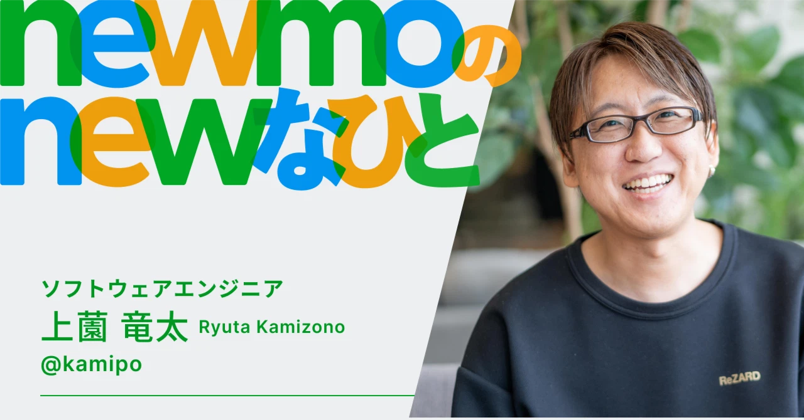

MySQLの思い出話
==========

2025/03/25 
MySQL30周年＆ユーザ会25周年記念イベント 
<address>
Ryuta Kamizono ([@kamipo](https://github.com/kamipo))
</address>

About me
----------

https://note.com/newmohq/n/n49e2901248e2

10年前(2015年)の思い出話をします
----------

* 2015年といえば、ハハパパ問題、寿司ビール問題発祥の年
 * 2015-04-01 [Bug #76553: Sushi-Beer issue of MySQL with utf8mb4](https://bugs.mysql.com/bug.php?id=76553)
 * この日は前々職の入社日だった👨‍🎓

ハハパパ寿司ビール問題
----------

https://bugs.mysql.com/bug.php?id=76553

    utf8mb4 character set treats Sushi Emoji (U+1F363) and Beer Emoji (U+1F37A) as same characters, when using utf8mb4_general_ci or utf8mb4_unicode_ci. Because both collations are treating same weight 0xfffd for Emoji. This issue is not limited to Emoji, but possible to all SMP characters.

ハハパパ寿司ビール問題
----------

https://bugs.mysql.com/bug.php?id=76553

    To treat these Emoji as different characters, either utf8mb4_bin or utf8mb4_unicode_520_ci should be used. However, utf8mb4_unicode_520_ci has another issue, so called Haha-Papa issue means Mother-Father issue in Japanese. "ハ" (U+30CF KATAKANA LETTER HA), "パ" (U+30D1 KATAKANA LETTER PA), and "バ" (U+30D0 KATAKANA LETTER BA) can not be recognized different characters.

ハハパパ寿司ビール問題
----------

元々はRailsのハハパパ問題解決のためにどういうストーリーだとより問題が伝わるかめちゃくちゃMySQLのUnicodeの挙動について調べてたら、寿司ビール問題の原理も説明できることに気づいた。

* 2015-03-08 [utf8_unicode_ci に対する日本の開発者の見解](https://blog.kamipo.net/entry/2015/03/08/145045)
* 2015-03-17 [MySQL と Unicode Collation Algorithm (UCA)](https://blog.kamipo.net/entry/2015/03/17/103457)
* 2015-03-23 [MySQL と寿司ビール問題](https://blog.kamipo.net/entry/2015/03/23/093052)

ハハパパ寿司ビール問題
----------

梶山さんに外部からissue報告してもらったほうが開発をつつきやすいと言われて寿司ビール問題としてissue報告したところ、MySQL開発陣はバカ受けだったらしい。

2 years later...
----------

* 2017-04-10 MySQL 8.0.1 has been released
* Unicodeの照合順序をバキバキに実装してきた
 * [MySQL8.0: 日本語のutf8bm4のCollation(文字照合順)](https://dev.mysql.com/blog-archive/mysql-8-0-1-japanese-collation-for-utf8mb4-ja_jp/)
 * [MySQL 8.0: ひらがなカタカナを判別する日本語用Collation](https://dev.mysql.com/blog-archive/mysql-8-0-kana-sensitive-collation-for-japanese-ja_jp/)

日本のコミュニティ発祥でMySQLのUnicode対応がバキバキに進歩したと言っても過言ではない。
----------

MySQL30周年＆MyNA25周年おめでとうございます🍣🍺
----------
